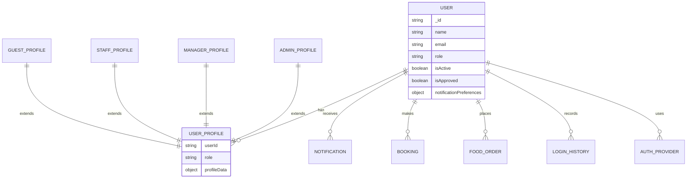
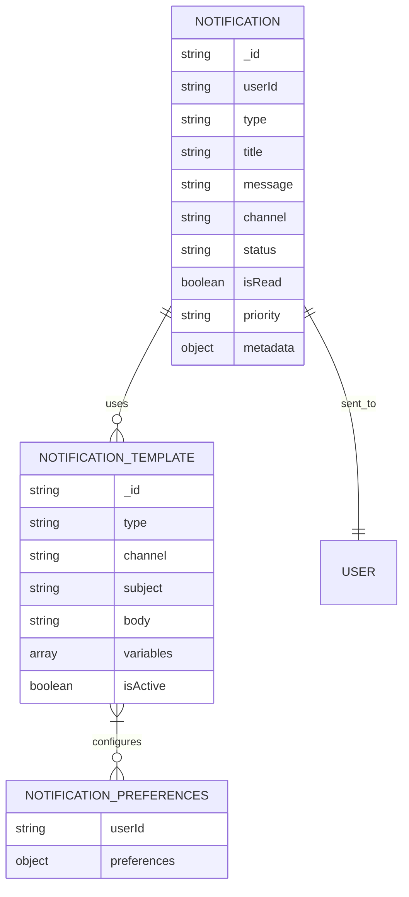
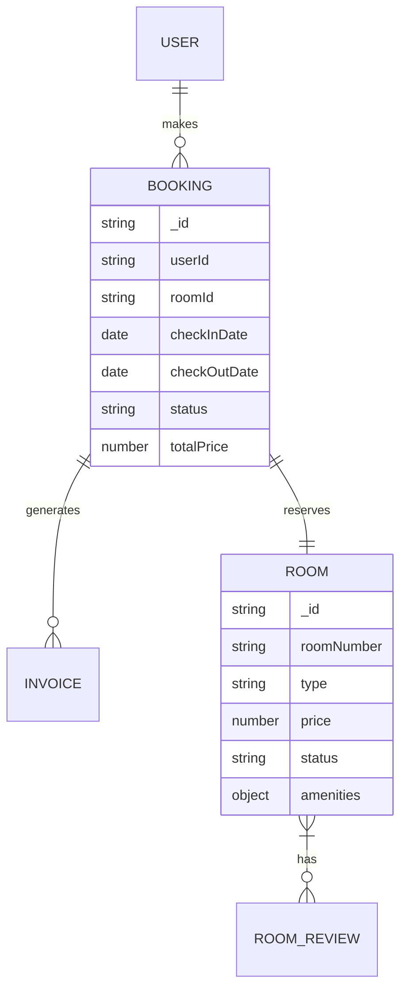

# Hotel Management System - Architecture Overview

## 1. System Overview

The Hotel Management System is a full-stack web application built with a modern MERN stack architecture. It provides comprehensive functionality for managing hotel operations including user management, room bookings, food services, staff scheduling, and notification systems.

### Key Features:
- Multi-role user system (guest, staff, manager, admin)
- Authentication and authorization with JWT tokens
- Role-based access control
- Notification system with multiple channels (email, SMS, in-app)
- Booking and room management
- Food ordering system
- Staff scheduling and task management
- Analytics and reporting

## 2. Backend Architecture

### 2.1 Technology Stack
- **Runtime**: Node.js with ES6 modules
- **Framework**: Express.js
- **Database**: MongoDB with Mongoose ODM
- **Authentication**: JWT (JSON Web Tokens)
- **Validation**: express-validator
- **Security**: helmet, express-rate-limit, express-mongo-sanitize, xss-clean, hpp
- **Logging**: morgan
- **Environment**: dotenv
- **Social Authentication**: Passport.js

### 2.2 Project Structure
```
backend/
├── config/              # Configuration files (database, environment)
├── controllers/         # Request handlers organized by feature
├── eventListeners/      # Event-driven notification listeners
├── middleware/          # Custom middleware (auth, validation, error handling)
├── models/              # Mongoose models and role-specific profiles
├── routes/              # API route definitions
├── services/            # Business logic separated by feature
├── utils/               # Utility functions and helpers
└── server.js            # Application entry point
```

### 2.3 Core Components

#### Authentication System
- JWT-based token authentication
- Role-based access control (RBAC)
- Social login support (Google, Apple)
- Email verification with OTP
- Password reset functionality
- Invitation-based registration for staff/admin roles

#### User Management
- Multi-role user system (guest, staff, manager, admin)
- Role-specific profiles with discriminators
- User approval workflow for non-guest roles
- Profile management and preferences

#### Notification System
- Multi-channel notifications (email, SMS, in-app)
- Notification templates with variable substitution
- User preference management
- Bulk notification sending
- Notification statistics and analytics

#### Booking System
- Room availability checking
- Booking creation and management
- Pricing calculations
- Invoice generation

#### Food Service System
- Menu management
- Food ordering
- Review system

#### Staff Management
- Staff scheduling
- Task assignment and tracking

### 2.4 API Structure
The backend exposes a RESTful API with the following main endpoints:

- `/api/auth/*` - Authentication and user registration
- `/api/admin/*` - Admin-specific operations (user management, invitations)
- `/api/notifications/*` - Notification operations
- `/api/bookings/*` - Booking operations
- `/api/rooms/*` - Room management
- `/api/food/*` - Food service operations
- `/api/staff/*` - Staff management operations

### 2.5 Security Features
- Rate limiting for API endpoints
- Input sanitization and validation
- XSS protection
- HTTP parameter pollution protection
- Helmet security headers
- JWT token versioning for logout
- Password hashing with bcrypt

## 3. Frontend Architecture

### 3.1 Technology Stack
- **Framework**: React 18 with Hooks
- **Routing**: React Router v6
- **State Management**: React Context API
- **UI Components**: Custom component library
- **Styling**: CSS Modules/Tailwind CSS
- **Date Handling**: date-fns
- **HTTP Client**: Axios
- **Notifications**: react-toastify

### 3.2 Project Structure
```
frontend/
├── src/
│   ├── assets/           # Static assets (images, icons, fonts)
│   ├── components/       # Reusable UI components
│   ├── context/          # React context providers
│   ├── hooks/            # Custom React hooks
│   ├── layout/           # Page layouts and structural components
│   ├── pages/            # Page components organized by role
│   ├── services/         # API service layer
│   ├── styles/           # Global styles and themes
│   ├── utils/            # Utility functions
│   ├── App.jsx           # Main application component
│   └── main.jsx          # Application entry point
├── public/               # Static files
└── package.json          # Dependencies and scripts
```

### 3.3 Role-Based Pages
- **Guest Pages**: Dashboard, booking management, profile
- **Staff Pages**: Dashboard, task management, schedule
- **Admin Pages**: Dashboard, user management, notifications, reports, settings

### 3.4 State Management
- **AuthContext**: User authentication state and profile data
- **NotificationContext**: Notification data, preferences, and actions
- **BookingContext**: Booking-related state (optional based on implementation)
- **ThemeContext**: Application theme (light/dark mode)

## 4. Data Flow and Relationships

### 4.1 User System


### 4.2 Notification System


### 4.3 Booking System


## 5. Key Features and Modules

### 5.1 Authentication & Authorization
- Multi-role user system with role-specific profiles
- JWT token-based authentication with refresh mechanism
- Social login integration (Google, Apple)
- Email verification with OTP
- Password reset functionality
- Role-based access control with permission levels
- Session management and logout

### 5.2 Notification System
- Multi-channel notification delivery (email, SMS, in-app)
- Notification templates with variable substitution
- User preference management per notification type
- Bulk notification sending for admin users
- Notification statistics and analytics dashboard
- Real-time notification updates
- Priority-based notification handling

### 5.3 User Management
- Role-based user management (guest, staff, manager, admin)
- Invitation system for staff and admin registration
- User approval workflow for non-guest roles
- Profile management with role-specific information
- Activity logging and audit trails
- User deactivation/reactivation

### 5.4 Booking Management
- Room availability checking and calendar view
- Booking creation, modification, and cancellation
- Pricing calculation with dynamic rates
- Invoice generation and payment processing
- Booking history and status tracking

### 5.5 Food Service Management
- Menu management with categories and items
- Food ordering system with cart functionality
- Order tracking and status updates
- Food review and rating system

### 5.6 Staff Management
- Staff scheduling and shift management
- Task assignment and tracking system
- Department-based organization
- Performance tracking and reporting

### 5.7 Analytics & Reporting
- Revenue analytics and reporting
- Occupancy rate tracking
- User activity analytics
- Notification delivery statistics
- Custom report generation

## 6. Deployment Architecture
- Environment-based configuration (development, production)
- Health check endpoints for monitoring
- Error handling and logging
- Security headers and best practices
- API rate limiting and protection